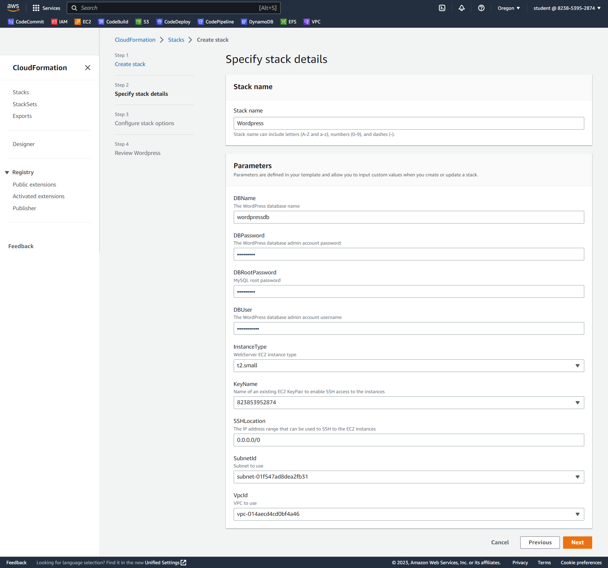
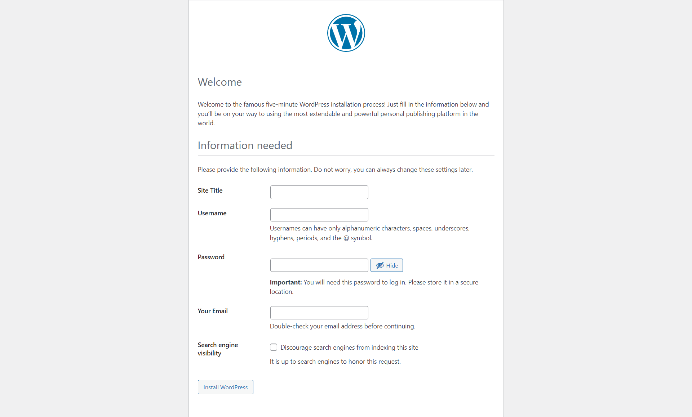

# Deploy Wordpress using CloudFormation

CloudFormation is a great tool for tying together related AWS resources such as instances, DynamoDB tables, IAM users, and more.
In this project deployed the WordPress CMS using a CloudFormation template .
This project provides a CloudFormation template for deploying a fully functional Wordpress site on AWS ,The template includes the necessary resources for a complete deployment, including an Amazon Elastic Compute Cloud (EC2) instance .

## Prerequisites
An AWS account
AWS networking basics
### Deployment Steps
1- start with cloudformationtemplet

2- watched your CloudFormation stack deploy and confirmed that WordPress was deployed on the EC2 instance.

3- review the resources managed by the stack:

The template for deploying Wordpress using CloudFormation typically includes the following resources:
1-An Amazon Elastic Compute Cloud (EC2) instance, which will serve as the web server for the Wordpress site.
2-An Amazon Relational Database Service (RDS) instance, which will store the Wordpress site's data.
3-An Amazon Elastic Block Store (EBS) volume, which will store the Wordpress files.

#### Cleanup

To delete the stack and all associated resources

#### Conclusion
Deployed  wordpress website via AWS Cloudformation templates

